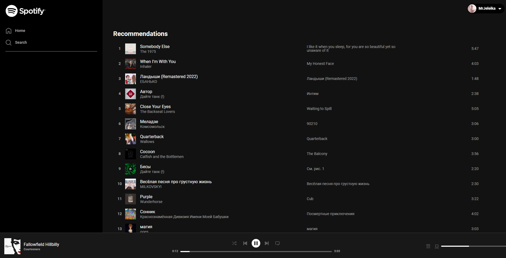

<h1 align="center">Spotify</h1>
<p align="center"></p>

## Technologies
<p>
  App built with React, Redux Toolkit, Tailwind, Spotify API, Framer motion
</p>
<h2 align="center"><a  href="https://spotify-mrjeleika.vercel.app/">Live Demo</a></h2>

## Description
Clone of popular music streaming service - Spotify. You can search, listen your songs directly through this application.
`PREMIUM REQUIRED`.

## Connecting
1. Login by your Spotify account
2. Go to your Spotify app, click on devices and choose `MrJeleika's Spotify`
3. Enjoy your music!

## Project setup
```
git clone https://github.com/MrJeleika/spotify.git
```

npm

```
npm install
npm start
```

yarn

```
yarn
yarn start
```
